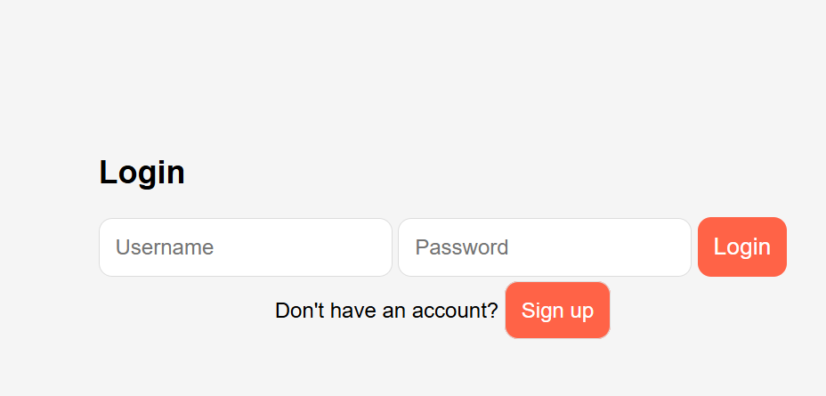
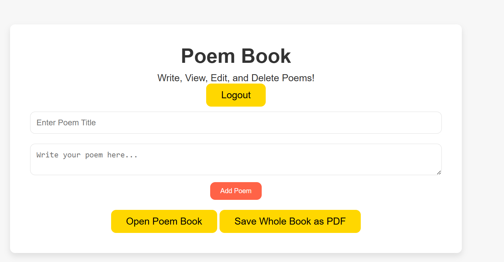
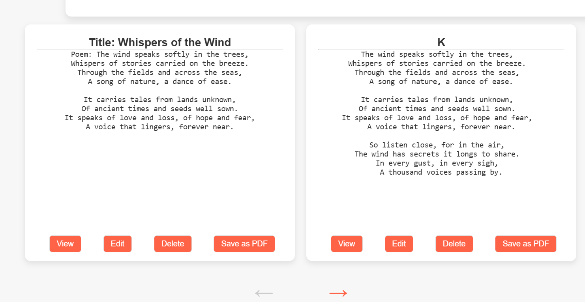

Absolutely! Here's a polished `README.md` for your **Poem Book App**, ideal for a GitHub repo or project showcase:

---

# 📖 Poem Book App

A simple yet elegant web application that allows users to write, view, edit, delete, and export their poems — all within a beautiful digital notebook interface. ✍️✨

---

## 🚀 Features

- ✅ **User Authentication** – Basic login/logout system using `localStorage`
- 📝 **Write Poems** – Input title and poem content
- 👁️ **View Poems** – Modal display with a clean layout
- ✏️ **Edit/Delete Poems** – Full CRUD functionality
- 📖 **Notebook UI** – Flip through your poems like a book
- 📄 **Export to PDF** – Save your entire poem collection with one click

---

## 🛠️ Tech Stack

- **HTML5 & CSS3**
- **Vanilla JavaScript**
- **[jsPDF](https://github.com/parallax/jsPDF)** – For exporting poems as PDF
- Modular JS files for better separation of concerns:
  - `auth.js` for authentication
  - `script.js` for main logic
  - `logout.js` for logout handling

---

## 📂 Project Structure

```
poem-book-app/
├── css/
│   └── style.css
|   └── login.css
|   └── signup.css
|   └── logout.css
├── js/
│   ├── auth.js
│   ├── script.js
│   └── logout.js
├── login/
│   └── login.html
|   └── signup.html
├── index.html
└── README.md
```

---

## 🧪 How to Run Locally

1. Clone the repo:
   ```bash
   git clone https://github.com/Kirti1902/poem-app
   ```

2. Navigate into the project:
   ```bash
   cd poem-book-app
   ```

3. Open `index.html` in your browser (use a live server for full functionality).

4. Make sure to access through the login page (`/login/login.html`) before using the main app.

---

## 🔐 Authentication Note

This app uses `localStorage` for simulating authentication. It's not secure for production use — just enough for demo or personal purposes.

---

## 📸 Screenshots *(Optional)*

> Add a few screenshots or a short GIF here to showcase the UI and experience.



---

## 💡 Future Enhancements

- Cloud-based user login with Firebase/Auth0
- Real-time database to store poems
- Dark mode toggle
- Shareable poem links or social integrations

---

## 👤 Author

**[Kirti J Chaudhary]** – *Frontend Enthusiast & Code Poet*

📬 [kirtichaudhary19@yahoo.com]  
🌐 [(https://github.com/Kirti1902/poem-app)]

---

## 📃 License

MIT License. Use it, break it, improve it, and make it your own!

---